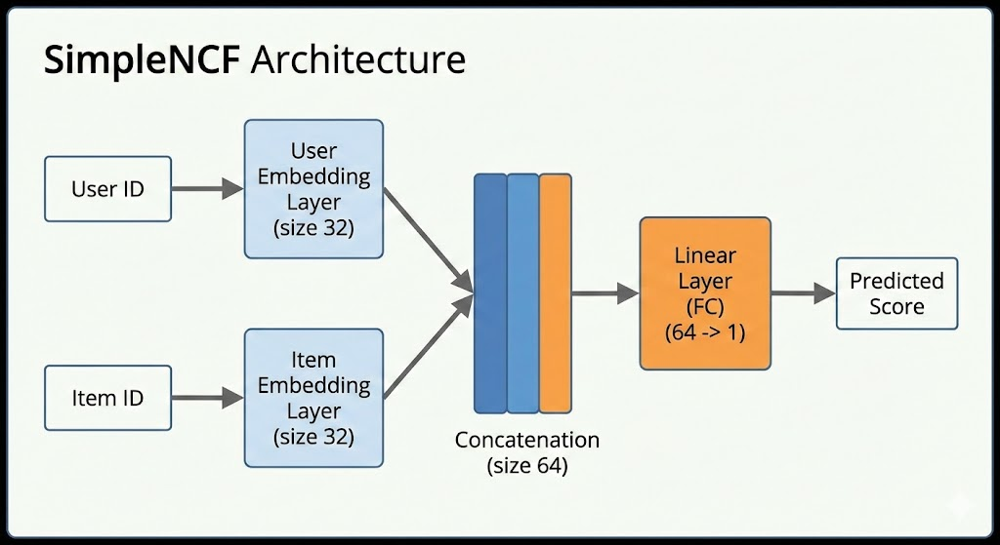

# Graphs For Recommendation Experimentation

In this repo you will find different experiments on Graph-based models for recommendation. 

The goal is to have a better understand of how these work.

Install requirements (e.g. on pyenv)

pip install -r requirements.txt

## Libraries

Pytorch

## NCF

### Dataset

I will be using the movie-lens latest small dataset with around 100k ratings, 610 unique users
and 9724 unique items (movies).

### SimpleNCF

#### Approach

The first approach is to have an MLP that takes as input a user & item embedding matrix,
which is OHEed. The user and item matrix will have size n_users x emb_dim, n_items x emb_dim,
respectively, where the embedding dimension is equal to 32.

The output of the MLP will be the linear result of the concatenation between the user and 
item embeddings.

The input featres of the MLP are the IDs of the users and items.

#### Architecture Visualization

Here is the flow of data:

    1. Input: User ID [42], Item ID [101]

    2. Embedding Lookup:
        - User 42 → [0.1, -0.5, ...] (Size 32)
        - Item 101 → [0.9, 0.2, ...] (Size 32)

    3. Concatenation:
        - Combines into one long vector → [0.1, -0.5, ..., 0.9, 0.2, ...] (Size 64)

    4. nn.Linear (The 1-Layer MLP):
        - Calculates weighted sum of those 64 numbers.

    5. Output:
        - Predicted Rating (e.g., 3.5).

#### nn.Linear()

In this context, it performs a weighted sum of the input features plus a bias term. Mathematically we have:

$$\hat{y}_{u,i} = \mathbf{W} \mathbf{x}_{u,i} + b$$